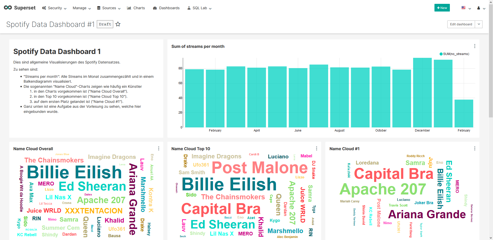
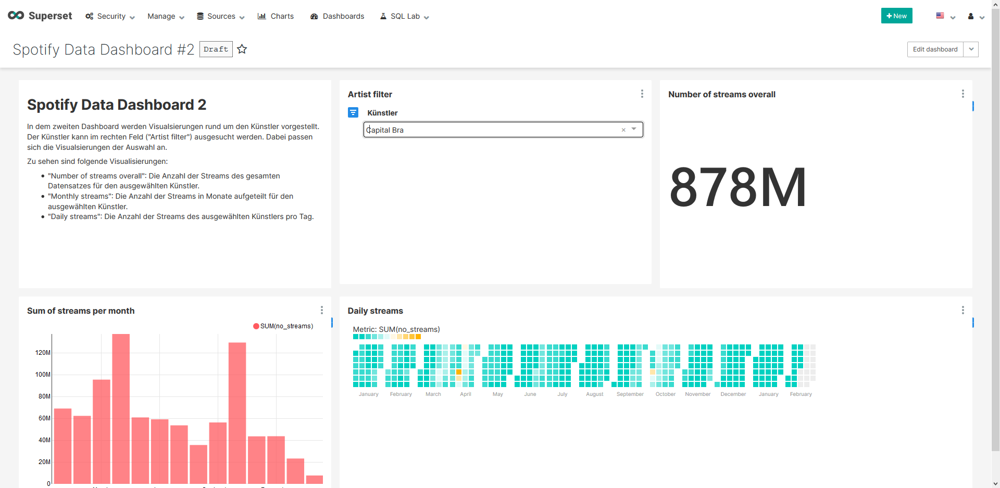

# Apache Superset & PostgreSQL Visualiazion of a Spotify dataset
The goal of this project is to provide an easy introduction to data visualization.
A Spotify data set, which is stored in a column oriented PostgreSQL database, is used to create a visualization using Apache Superset.
This repository provides scripts to set up a simple environment with Superset and PostgreSQL using Docker.

## Some insights
These are some insights of a dashboard in Superset of the Spotify dataset:




## Getting started
These instructions will get you a copy of the project up and running on your local machine for development and exploring purposes.

### Prerequisites
Make sure you have installed all of the following prerequisites on your development machine:

* Git - [Download & Install Git](https://git-scm.com/downloads). OSX and Linux machines typically have this already installed.
* Docker (v19.03.0 or above) - [Download & Install Docker](https://docs.docker.com/get-docker/). Please install also docker-compose.

### How to use it
First you need to clone this repository:

```bash
git clone git@github.com:michaelweidmann/superset-postgresql-spotify-dataset.git
cd superset-postgresql-spotify-dataset
```

And then you can start right away:

Unix-Systems:

```bash
./run.sh
```

Windows:

```bash
run.bat
```

Theses scripts will get you an instance of Superset and PostgreSQL up and running!
After the script has run through, the Superset interface can be accessed with `http://localhost:8080`.
The credentials are `admin` for the username and password.
Explore now the world of Apache Superset!

### How to destroy it
To destroy it run either `./delete-data.sh` on Unix systems or `delete-data.bat` on Windows systems.
It will completely remove all containers, networks and volumes.
If you need your volume afterwards, **do not** execute the script.
Just use `docker-compose down`.

## Project structure
```
.
+-- assets                  --> Some resources for this README
+-- postgres                --> Contains files related to the database
|   +-- *.csv               --> The Spotify dataset in CSV files
|   +-- import.sh           --> The script which will be executed in the container
|   +-- import.sql          --> The SQL script which will import the dataset into the database
|   +-- setup.sh/setup.bat  --> The setup scripts which will be called of the run script
+-- superset                --> Contains files related to superset
|   +-- dashboards.json     --> The spotify dashboards which can be loaded to superset
|   +-- datasources.yaml    --> The datasources which can be loaded to superset
|   +-- Dockerfile          --> The Dockerfile containing the customized Superset image
|   +-- import.sh           --> The script which will be executed in the container
|   +-- setup.sh/setup.bat  --> The setup scripts which will be called of the run script
+-- delete-data.bat         --> Stops containers and removes data
+-- delete-data.sh          --> Stops containers and removes data
+-- docker-compose.yml      --> Docker-Compose configuration file
+-- run.sh/run.bat          --> The run scripts
```

## Deep insights

### What does the script do?
The script starts with `docker-compose up -d` the column-oriented PostgreSQL and the Apache Superset container.
Then the PostgreSQL database is filled with the data from the Spotify dataset.
Now the PostgreSQL database is ready to use.

After that Superset is set up.
First an admin user is created and the metadata database of Superset is initialized.
Then the database connection and the dashboards are loaded into the Superset container.

The sub-script of the PostgreSQL initialization can be found [here (Unix)](postgres/setup.sh) or [here (Windows)](postgres/setup.bat).
The sub-script of the Superset initialization can be found [here (Unix)](superset/setup.sh) or [here (Windows)](superset/setup.bat).

### Why Dockerfile?
[](https://hub.docker.com/r/michaelweidmann/superset-postgresql)

As the [official Dockerfile](https://hub.docker.com/r/preset/superset/) of Superset does not have any database drivers installed, I created an image with the PostgreSQL driver.
It is needed to connect from Superset to a PostgreSQL database.
Every week a new Docker image is built with Github Actions and published to [Docker Hub](https://hub.docker.com/r/michaelweidmann/superset-postgresql).
